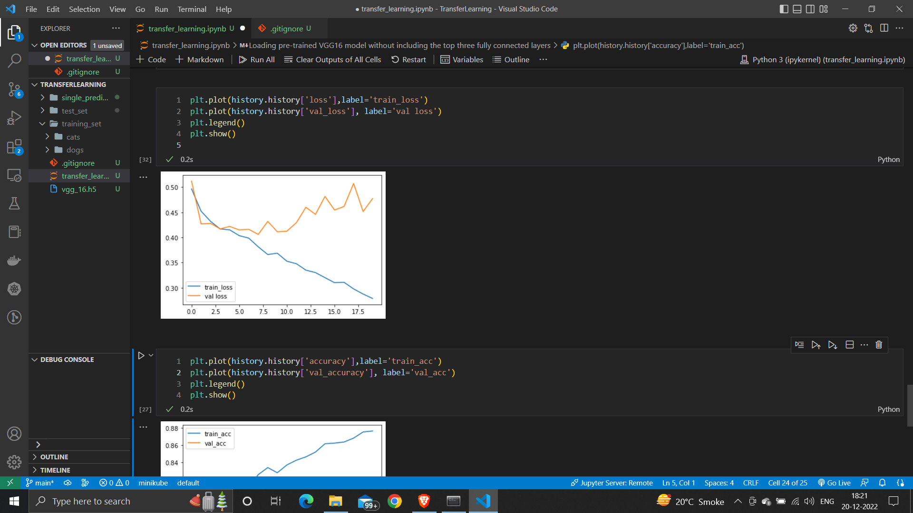
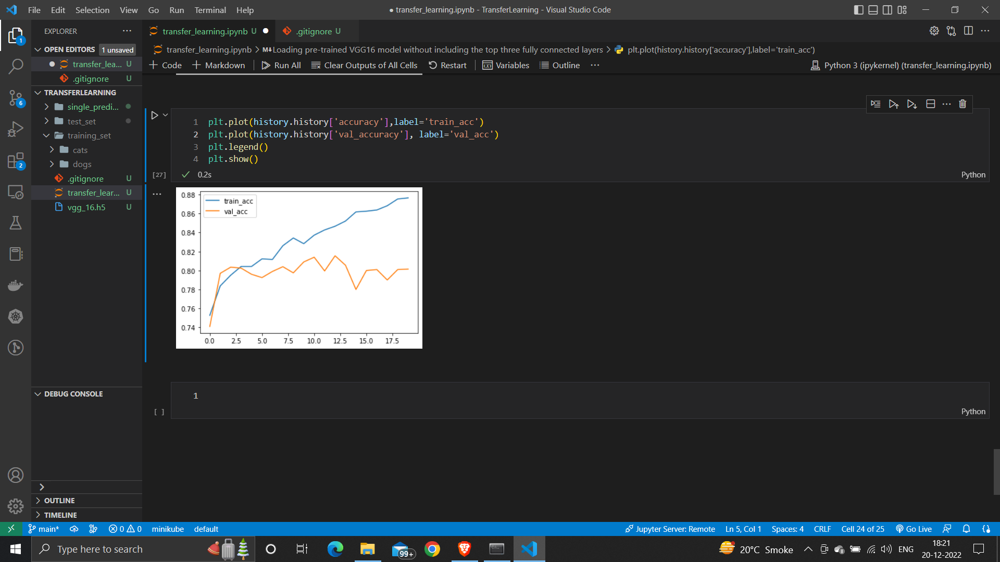

# Transfer Learning

### Used VGG16 Net to train 3 models to classify if given image is cat or dog. The first two were overfitting, then I reduced the fully connected layers and it worked well.

#### Graphs showing overfitting of second model.

